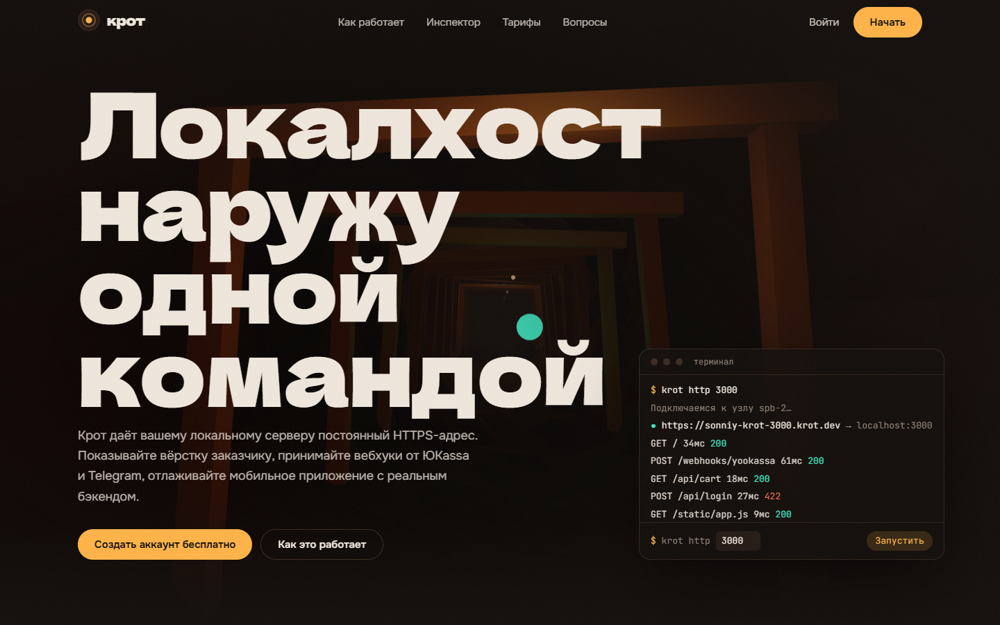
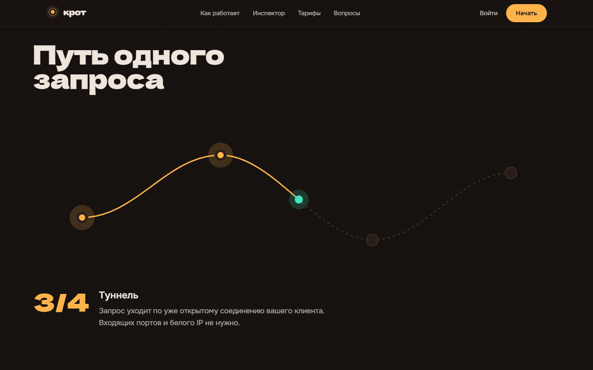
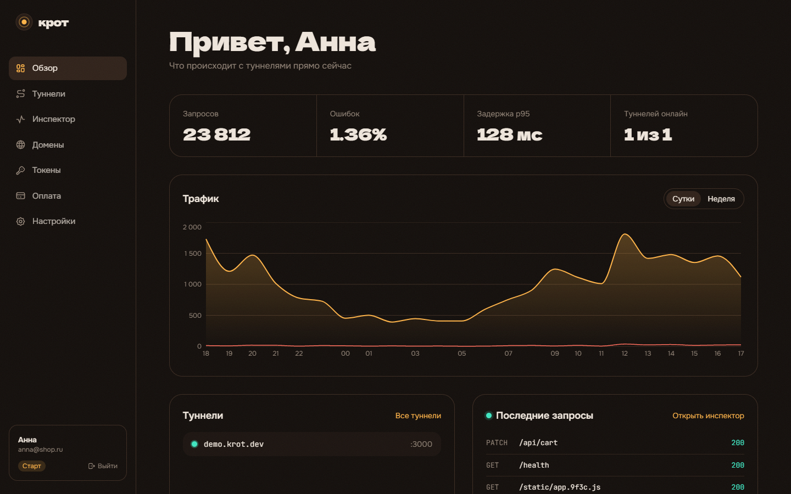
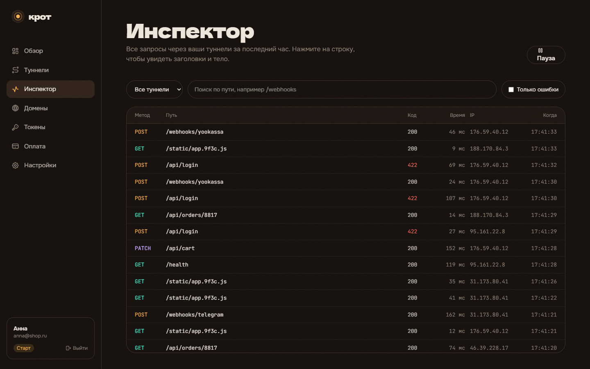
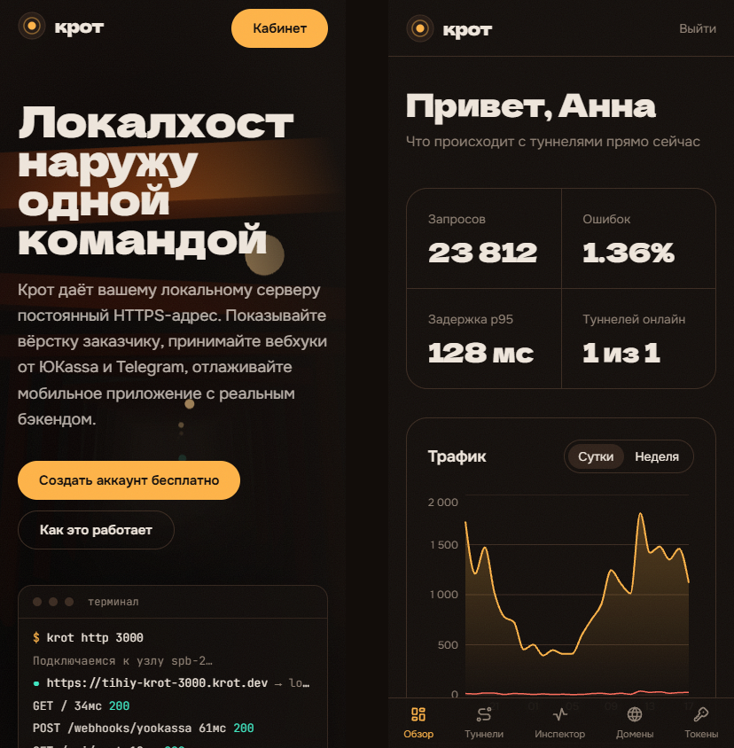

# Крот

Сервис туннелей к локальному серверу, аналог ngrok. Клиент `krot` держит исходящее
соединение с узлом, узел выдаёт публичный адрес и пропускает через это соединение
HTTP-запросы к `localhost`. Веб-кабинет показывает туннели, трафик и каждый запрос
с заголовками и телом, умеет повторять запросы.

**Демо:** [youngover.github.io/krot](https://youngover.github.io/krot/). В демо API работает
прямо в браузере через Service Worker, регистрация настоящая по форме, код подтверждения `424242`.



## Что внутри

| Часть | Стек | Где |
|---|---|---|
| Узел и клиент туннеля | Go, свой протокол мультиплексирования поверх TCP | `server/internal/relay`, `server/cmd/krot` |
| API кабинета | Go `net/http`, bcrypt, JWT, ротация refresh-токенов | `server/internal/api`, `server/internal/auth` |
| Веб | React 19, TypeScript, Vite, Tailwind 4, Framer Motion, React Three Fiber, TanStack Query, Zustand | `web/` |
| Демо без бэкенда | MSW, тот же контракт API, состояние в localStorage | `web/src/mocks` |

### Туннель

Один клиент открывает одно TCP-соединение к узлу. Каждый входящий HTTP-запрос
получает свой поток внутри этого соединения:

```
type u8 | stream u32 | length u32 | payload
```

Кадры `OPEN`, `DATA`, `CLOSE` с полузакрытием, поэтому запрос и ответ идут
независимо, а большие тела режутся на куски по 32 КБ. Узел проверяет токен клиента
и владельца поддомена при рукопожатии, пишет в инспектор первые 64 КБ тела запроса и
ответа. Клиент при обрыве переподключается с экспоненциальной задержкой к тому же адресу.

Тесты: 40 параллельных запросов через одно соединение, тело 3 МБ, отказ по
поддельному токену, `502` при выключенном локальном сервере.

### Авторизация

- Пароли в bcrypt, вход сравнивает с фиктивным хешем для несуществующих почт, чтобы по
  времени ответа нельзя было перебирать аккаунты.
- Регистрация с шестизначным кодом, 5 попыток на код, ограничение 10 запросов в минуту на IP.
- Access-токен JWT на 15 минут живёт только в памяти вкладки.
- Refresh-токен в `httpOnly`, `SameSite=Strict` cookie, меняется при каждом обновлении.
  Повторное предъявление уже использованного токена отзывает всю цепочку сессии:
  так обнаруживается кража. Выход и отзыв сессии действуют сразу, а не через 15 минут.
- Токены для CLI хранятся только в виде SHA-256, секрет показывается один раз.

Сквозной тест в `server/internal/api/e2e_test.go` проходит путь целиком:
регистрация, туннель, токен, подключение клиента, публичный запрос, инспектор,
повтор запроса, ротация refresh, выход, доступ чужого пользователя.

### Интерфейс



- Первый экран: шахта на WebGL, крепи и лампы через instanced mesh, пакет запроса
  пролетает по туннелю, когда в терминале запускается команда.
- Секция «Путь запроса» управляется прокруткой: схема закреплена, пакет идёт по
  кривой, узлы загораются по очереди.
- Переходы между сайтом, входом и кабинетом раскрываются кругом; внутри кабинета
  страницы меняются с размытием, активный пункт меню и вкладки перетекают через shared layout.
- Оптимистичное выключение туннеля с откатом при ошибке, повтор запроса, одноразовый
  показ секрета токена, ввод кода с автопереходом и вставкой из буфера.
- Адаптив до 360 px, видимый фокус, `prefers-reduced-motion` отключает анимации.

| Обзор | Инспектор |
|---|---|
|  |  |



## Запуск

```bash
# сервер: API :8081, публичный узел :8080, клиенты :7000
cd server && go run ./cmd/krotd

# кабинет против настоящего API (прокси /api на :8081)
cd web && npm ci && VITE_REAL_API=1 npm run dev

# код подтверждения при разработке печатается в лог krotd;
# после создания туннеля и токена в кабинете:
cd server && go run ./cmd/krot http 3000 --subdomain shop --token krt_...
curl -H "Host: shop.krot.localhost:8080" localhost:8080/
```

Без `VITE_REAL_API=1` кабинет работает на встроенном демо-API, как на GitHub Pages.

```bash
make test   # go vet, go test -race, сборка фронтенда
```

## Ограничения

- Данные сервера хранятся в памяти. Для продакшена пользователей, туннели и токены
  нужно перенести в PostgreSQL, запросы инспектора в таблицу с ограничением по объёму.
- TLS на узле и выпуск сертификатов для своих доменов через ACME не реализованы:
  проверка CNAME есть, сертификат нет.
- Оплата в кабинете меняет тариф без платёжного шлюза.
